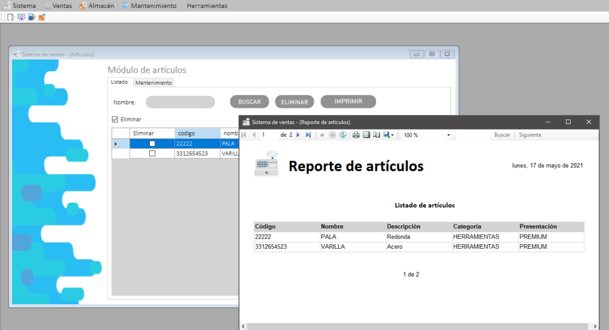

# Punto de venta profesional en C# y MSSQLServer v1.0.0
## Descripción del proyecto

Este proyecto radica en un punto de venta especializado en cualquier tipo de negocios,
desde ferreterías, hasta abarrotes. Cuenta con multiples modulos como proveedores, trabajadores, mantenimiento, ventas, entre otros mas. Esta desarrollado con C# y Microsoft SQL
Server. Este fue un proyecto final de preparatoria en donde utilizariamos todo lo referente
a la carrera, desde el analisis de sistemas, rendimiento, bases de datos, programación orientada a objetos, arquitectura de software y seguridad informatica. Este fue entregado
a un cliente de una ferreteria con el que recibiriamos titulo excento.

## Imagenes

Login principal

Modulo de categorías

Ejemplo de modulo de categorías (existen muchas mas)

Modulo de reportes de inventarios en PDF y EXCEL

Modulo de facturas

## Para más información

El proyecto esta estructurado con arquitectura de programacion por capas, en donde
cuenta con distintos modulos y submodulos para facilitar la escalabilidad.

Se pueden leer los PDF para comprender mas a fondo el sistema. Actualmente ya no tiene soporte.

## Aclaración

Este proyecto se sube con fines informativos, fue realizado en el año 2021. Tuvo 6 meses de desarrollo, desde la documentación, analisis, exploracion de requisitos, programacion,
bases de datos y visitas con el cliente.

